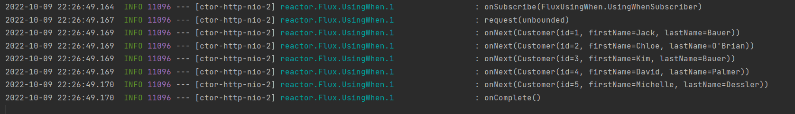

# WebFlux

## API
- ### GET localhost:8080/flux
  - 1초에 하나씩 1, 2, 3, 4, 5 5개의 데이터를 Flux 타입으로 반환 
  - 웹 페이지에는 5개의 데이터를 다 받은 후에 한 번에 뜸
- ### GET localhost:8080/fluxstream
  - produces = MediaType.APPLICATION_STREAM_JSON_VALUE 이용
  - 데이터가 반환될 때마다 바로 웹 페이제에 표시되도록 함
  - 1,2,3,4,5 데이터를 순차적으로 반환
- ### GET localhost:8080/customer
  - DB의 Customer 테이블에 넣어둔 모든 데이터를 1초마다 하나씩 비동기로 리턴
  - 하나씩 응답된 후에 데이터 전송이 완료되면 클라이언트가 더이상 추가 데이터를 기다리지 않음
- ### GET localhost:8080/customer/{id}
  - Mono 타입의 리턴 (리턴 값이 1개 이므로)
  - 파라미터로 받은 id 에 해당하는 customer 반환
- ### GET localhost:8080/customer/sse
  - Flux<ServerSentEvent<Customer>> 타입의 리턴
  - ServerSentEvent 타입의 경우 produces = MediaType.TEXT_EVENT_STREAM_VALUE 를 생략해도 자동으로 해당 타입을 이용
  - 싱크의 데이터가 합쳐지면 그 합쳐진 데이터를 응답 
  - doOnCancel에 blockLast를 안해주면 클라이언트가 연결을 끊은 후에 다시 /customer/sse로 연결하려고 해도 정상동작하지 않음
    - SSE 연결을 통해 데이터를 받은 후에도 계속해서 로딩되는데, 이 로딩을 끊은 후에는 doOnCancel에 blockLast를 해주지 않으면 다시 해당 url로 연결이 불가능하다는 뜻
      - ### POST localhost:8080/customer
        - 새로운 customer 데이터를 DB에 저장
        - save 된 후 doOnNext를 통해 어떻게 sink가 새 데이터를 인지하게 만들지도 구현해야 함


## Sink
    Sinks란??
    A요청 -> Flux -> Stream
    B요청 -> Flux -> Stream
    A,B 각 요청에 대한 응답이 Flux라 할 때 두 개의 응답 Stream을 Merge할 수 있음
    Flux.merge -> sink (싱크가 맞춰짐)

    Sinks.many().multicast() : 새로 생긴 데이터만 구독자에게 전달해주는 방식


## Test
### 단위 테스트
```java
@WebFluxTest    //Repository가 떠있지 않은 상태이므로 Repository 이용한 테스트 불가
public class CustomerControllerTest {
  /**
   * @WebFluxTest를 이용하는 경우
   * */
  @MockBean                       // Repository가 자동으로 등록되지 않으므로 MockBean 사용
  CustomerRepository repository;  //가짜 객체이므로 findAll() 등의 메서드 사용 불가

  @Autowired
  private WebTestClient webClient;    //비동기로 http 요청하는 클라이언트

  @Test
  public void 테스트() {
    ...
  }
}
```

### 통합 테스트
```java
@SpringBootTest //통합테스트이므로 전부 다 메모리에 띄워두고 테스트하는 것
@AutoConfigureWebTestClient //WebTestClient 띄우기 위한 것
public class CustomerControllerTestForIntegrationTest {
    /**
     * @SpringBootTest를 수행하는 경우
     * */

    @Autowired
    private WebTestClient webTestClient;
    @Autowired
    private CustomerRepository customerRepository;

    @Test
    public void 한건찾기_테스트() {
      ...
    }
}
```

## 기타
- Flux.just(1,2,3,4,5) or Mono.just(1)
  - just는 파라미터로 받은 데이터를 순차적으로 꺼내서 던져주는 역할
  - 파라미터로 받은 값을 Flux/Mono로 반환

<Flux를 통해 비동기로 응답할 때 로그 형태>


[참고 유튜브 링크](https://www.youtube.com/watch?v=rQXAvCNsZ8I&list=PL93mKxaRDidFH5gRwkDX5pQxtp0iv3guf&index=6)